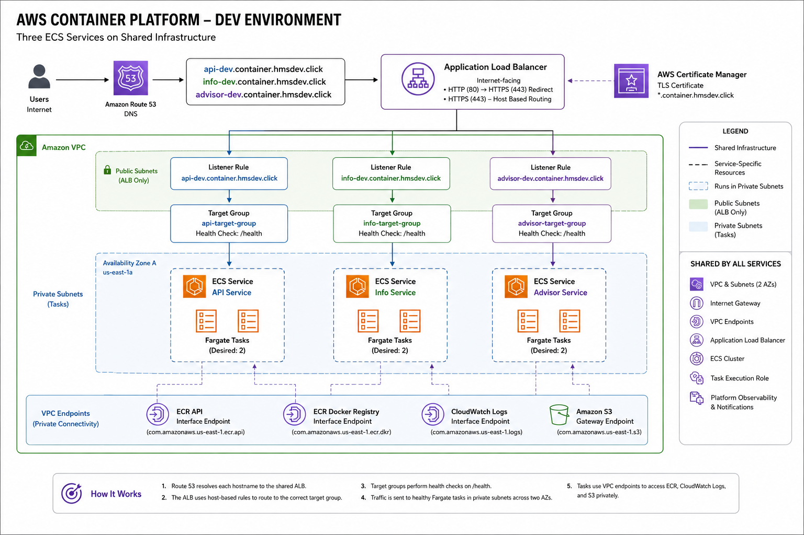

# AWS Container Platform

A reusable AWS container platform built with Docker, Amazon ECR, Amazon ECS on AWS Fargate, Application Load Balancer, Route 53, CloudWatch, Terraform, and GitHub Actions.

The project started with a single FastAPI container and evolved into a shared platform that currently runs three independently deployable services. The infrastructure is designed around a clear boundary: shared resources belong to the platform, while routing, compute, IAM, scaling, logging, and observability that are specific to an application belong to that service.

## Summary

This project started as a way to get hands-on with Docker, Amazon ECR, and Amazon ECS on AWS Fargate. Rather than designing a generalized platform up front, I built a working service first and introduced abstractions when additional workloads exposed a reason for them.

The platform currently runs three services:

- **API** — the original FastAPI health service used to establish and validate the container deployment path.
- **Info** — a second FastAPI service added to prove that another application could use the same platform without duplicating the underlying infrastructure.
- **Architecture Advisor** — a more substantial FastAPI application that accepts workload requirements and returns an AWS architecture recommendation.

Terraform separates shared infrastructure from service-scoped resources. The VPC, subnets, VPC endpoints, Application Load Balancer, ECS cluster, task execution role, and platform-level observability are shared. Each service gets its own ALB routing, DNS record, task definition, ECS service, IAM task role, autoscaling configuration, log group, and service-level alarms.

Container images are stored in separate ECR repositories and deployed using immutable tags. GitHub Actions handles testing, container validation and publishing, Terraform plan/apply/destroy workflows, and post-deployment verification.

The result is less about any individual container and more about the boundaries between applications and the infrastructure responsible for running them.

---

## Architecture



The ALB is the public ingress layer. Port 80 redirects to HTTPS, and host-based rules on the HTTPS listener route each hostname to the correct target group.

Fargate tasks run in private subnets without public IP addresses. They use VPC endpoints for the AWS services required during container startup and operation, so the platform doesn't need a NAT gateway for those paths.

### Shared and Service-Scoped Resources

The platform deliberately separates infrastructure by ownership.

**Shared per environment:**

- VPC, public/private subnets, and routing
- Internet Gateway
- VPC endpoints
- Application Load Balancer
- HTTP and HTTPS listeners
- ECS cluster
- ECS task execution role
- ECS task security group
- platform-level observability and notifications

**Created per service:**

- ALB target group and HTTPS listener rule
- Route 53 record
- ECS task definition and service
- dedicated IAM task role
- CloudWatch log group
- ECS Service Auto Scaling target and policy
- CPU and memory alarms
- unhealthy-target alarm
- target 5xx alarm

Adding another application therefore doesn't require another VPC, ALB, or ECS cluster.

---

## Running Services

### API

The API is the original FastAPI application used to build and validate the platform. Its small endpoint set makes container health, ALB routing, and ECS deployment behavior easy to verify.

```text
GET /
GET /health
GET /ready
```

**DEV:** `https://api-dev.container.hmsdev.click`
**Image:** `v0.1.0-fastapi-health-api`

### Info

The Info service was the first real test of the platform abstraction.

Instead of creating another copy of the infrastructure, Info is another entry in the Terraform `services` map. Its service-specific resources are created independently while it reuses the existing network, ALB, ECS cluster, VPC endpoints, and other shared resources.

**DEV:** `https://info-dev.container.hmsdev.click`
**Image:** `v0.1.0-fastapi-info-api`

### Architecture Advisor

The Architecture Advisor is the third service and the first workload on the platform with meaningful application logic beyond infrastructure validation.

It accepts structured AWS workload requirements through:

```text
POST /advise
```

A request can describe the workload type, traffic pattern, availability requirement, data requirement, expected scale, and architecture priorities.

For example:

```json
{
  "workload_type": "web_application",
  "traffic_pattern": "variable",
  "availability_requirement": "high",
  "data_requirement": "relational",
  "expected_scale": "medium",
  "priorities": [
    "security",
    "reliability",
    "cost_optimization"
  ]
}
```

The response includes:

- an architecture summary
- recommended AWS services and their purpose
- compute, networking, data, security, and observability guidance
- Well-Architected strengths and considerations
- architecture tradeoffs
- suggested next steps

For a medium-scale web application with variable traffic, high availability, and relational data, the recommendation can include components such as Application Load Balancer, Amazon ECS on AWS Fargate, Amazon Aurora, and ECS Service Auto Scaling.

The recommendation engine is intentionally deterministic rather than generative. That keeps architecture rules directly testable and produces predictable results for the same workload requirements.

**DEV:** `https://advisor-dev.container.hmsdev.click`
**Interactive API docs:** `https://advisor-dev.container.hmsdev.click/docs`
**Image:** `v0.1.1-architecture-advisor`

---

## Platform Design

### Terraform Service Model

Application services are declared through a Terraform map instead of being hardcoded into the reusable platform module.

Conceptually, an environment supplies configuration like this:

```hcl
services = {
  api = {
    hostname        = "api-dev.container.hmsdev.click"
    container_image = "<api-ecr-repository>:v0.1.0-fastapi-health-api"
    # capacity, routing, scaling, and logging settings...
  }

  info = {
    hostname        = "info-dev.container.hmsdev.click"
    container_image = "<info-ecr-repository>:v0.1.0-fastapi-info-api"
    # ...
  }

  advisor = {
    hostname        = "advisor-dev.container.hmsdev.click"
    container_image = "<advisor-ecr-repository>:v0.1.1-architecture-advisor"
    # ...
  }
}
```

The `container-platform` module uses `for_each` over this map to create the resources that belong to each workload.

The reusable module doesn't need to know what the API, Info service, or Architecture Advisor does. From the platform's point of view, each application is a service with a hostname, container image and port, capacity settings, listener priority, autoscaling configuration, and logging requirements.

Application behavior stays with the application. The platform is responsible for running it.

### Terraform Modules

Terraform is split into modules with clear ownership boundaries.

| Module | Responsibility |
| --- | --- |
| `container-platform` | Composes shared infrastructure and service-scoped modules |
| `network` | VPC, subnets, routing, and security groups |
| `vpc-endpoints` | Private connectivity to ECR, CloudWatch Logs, and S3 |
| `alb` | Shared ALB and HTTP/HTTPS listeners |
| `alb-service-routing` | Per-service target groups and host-based listener rules |
| `dns` | Per-service Route 53 records |
| `ecs-cluster` | Shared ECS cluster |
| `ecs-task-execution` | Shared ECS task execution role |
| `ecs-task-role` | Dedicated IAM role for each application workload |
| `ecs-services` | Task definitions, ECS services, and log groups |
| `ecs-autoscaling` | Per-service CPU target-tracking scaling |
| `observability` | Service-level CloudWatch alarms |
| `platform-observability` | Shared platform-level alarms |
| `notifications` | SNS topic used by CloudWatch alarms |
| `ecr` | Immutable application image repositories |
| `tls` | ACM certificate and DNS validation |

The composition module connects these pieces rather than implementing every AWS resource itself.

### Networking

The environment spans two Availability Zones and contains public and private subnets.

The public subnets host the internet-facing ALB. Application tasks run in the private subnets and don't receive public IP addresses.

Security-group traffic is intentionally narrow:

```text
Internet
   |
   | TCP 80 / 443
   v
Application Load Balancer
   |
   | TCP 8000
   v
ECS Tasks
   |
   | TCP 443
   +--------------------+
   |                    |
   v                    v
Interface             Amazon S3
VPC Endpoints         Gateway Endpoint
```

ECS tasks can receive application traffic from the ALB and reach the AWS endpoints required by the platform. They don't have unrestricted outbound internet access.

The platform currently provisions:

- ECR API interface endpoint
- ECR Docker registry interface endpoint
- CloudWatch Logs interface endpoint
- S3 gateway endpoint

This allows Fargate tasks to pull images and publish logs while remaining on private network paths. The S3 gateway endpoint is also required for the ECR image-layer download path.

### HTTPS and Host-Based Routing

Route 53 records for each application point to the shared ALB.

The ALB uses:

- port 80 for HTTP-to-HTTPS redirection
- port 443 for TLS termination
- an ACM certificate for `*.container.hmsdev.click`
- host-based listener rules for individual services

Each service owns its target group and listener rule. This keeps shared ingress infrastructure separate from application-specific routing.

Current DEV routing is:

```text
api-dev.container.hmsdev.click
    -> API target group
    -> API ECS service

info-dev.container.hmsdev.click
    -> Info target group
    -> Info ECS service

advisor-dev.container.hmsdev.click
    -> Advisor target group
    -> Advisor ECS service
```

### IAM Boundaries

ECS uses two IAM roles for different purposes.

The shared **task execution role** is used by ECS itself for operations such as pulling container images from ECR and sending logs to CloudWatch.

A service's **task role** is assumed by the application code running inside the container when that workload needs to call AWS APIs.

Each service gets a dedicated task role. Keeping workload permissions separate from the shared execution role allows application permissions to evolve independently and avoids turning the execution role into a general-purpose application identity.

### AWS Naming Constraints

Adding the Architecture Advisor exposed an ALB constraint that wasn't visible with the shorter API and Info service names: target group names are limited to 32 characters.

Short service names keep the normal human-readable platform name. Longer names are shortened deterministically and receive a hash suffix.

For example:

```text
Logical name:
aws-container-platform-dev-advisor

Target group:
aws-container-platform--92167614
```

The full logical name remains in resource tags.

Using a deterministic hash avoids arbitrary truncation that could create collisions between services with similar long names.

### Scaling and Observability

Each service has its own ECS Service Auto Scaling configuration. The current implementation uses CPU target tracking with configurable minimum and maximum capacity, target CPU utilization, and scale-in/scale-out cooldown periods.

Observability is also split between platform and service concerns.

Service-level alarms monitor:

- ECS CPU utilization
- ECS memory utilization
- unhealthy ALB targets
- target HTTP 5xx responses

The shared ALB has a platform-level 5xx alarm.

Each service writes application logs to its own CloudWatch log group, and alarms can publish to the platform SNS topic.

Health checks operate at several layers. Each application exposes `/health` and `/ready`; ALB target groups use `/health`; ECS deployment verification waits for service stability; and external HTTPS checks verify the complete DNS → ALB → target → application path.

---

## Container Images and Releases

Each application has its own ECR repository:

```text
aws-container-platform-api
aws-container-platform-info
aws-container-platform-advisor
```

The repositories use immutable image tags and image scanning. Mutable deployment aliases such as `latest`, `dev`, or `prod` aren't used.

### Image Provenance

A newly built image is first pushed using the full Git commit SHA. That tag establishes a direct link between the source revision and the container artifact.

A friendlier release tag can then be assigned to the same ECR manifest.

For example:

```text
<full-git-sha>
v0.1.0-architecture-advisor
```

Both tags refer to the same image digest.

The release workflow doesn't rebuild the container to create the friendly tag. It verifies that the SHA image exists, retrieves its manifest, checks that the requested release tag doesn't already exist, and applies the new immutable tag to that manifest.

That distinction matters. A release name describes an artifact that has already been built and identified; it doesn't create a second artifact that merely looks equivalent.

Environment configuration references the explicit immutable release tag, so the image intended for deployment is visible in Terraform.

---

## CI/CD

GitHub Actions handles validation, image publishing, and the Terraform deployment lifecycle.

AWS authentication uses GitHub's OIDC integration rather than long-lived AWS access keys stored as repository secrets.

### Continuous Integration

CI validates the repository before infrastructure changes are merged. The workflow includes application tests, container build validation, and Terraform checks.

The multi-service layout means container validation needs to cover each application image rather than assuming the root Dockerfile represents the entire platform.

### ECR Publishing

The ECR publishing workflow supports the image lifecycle described above:

```text
source commit
     |
     v
build container
     |
     v
push immutable Git SHA tag
     |
     v
promote same manifest
     |
     v
friendly immutable release tag
```

Separate repositories keep application release histories independent.

### Terraform Plan, Apply, and Destroy

Terraform changes follow a review-oriented workflow:

```text
feature branch
     |
     v
pull request
     |
     v
CI + Terraform plan
     |
     v
review / merge
     |
     v
Terraform apply
     |
     v
runtime verification
```

The plan workflow provides an environment-specific Terraform plan for review. When deployment is requested, the apply workflow generates its own saved plan, summarizes the services and container images in scope, and applies that plan.

A successful Terraform apply isn't treated as proof that the application is healthy.

Post-deployment verification checks the runtime state, including ECS service stabilization, running tasks, the image deployed to ECS, target health, DNS, and application endpoints.

A controlled destroy workflow is also available so environments that aren't needed continuously can be removed without deleting the shared ECR foundation.

---

## Repository Structure

```text
.
├── app/                       # Original API
├── services/
│   ├── info/                  # Info service
│   └── advisor/               # Architecture Advisor
├── tests/
├── terraform/
│   ├── environments/
│   │   ├── dev/
│   │   └── prod/
│   ├── foundation/
│   │   └── ecr/
│   └── modules/               # Reusable Terraform modules
├── .github/
│   └── workflows/
├── Dockerfile
├── requirements.txt
├── requirements-dev.txt
└── README.md
```

The ECR repositories live in a separate Terraform foundation layer so container artifacts can outlive individual environment deployments. DEV or PROD can therefore be destroyed and rebuilt without also destroying the images required to recreate them.

---

## Local Development and Testing

### Python

Create and activate a virtual environment:

```bash
python3 -m venv .venv
source .venv/bin/activate
```

Install development dependencies:

```bash
python -m pip install -r requirements-dev.txt
```

Run the original API:

```bash
python -m uvicorn app.main:app --reload
```

Run the Architecture Advisor from the repository root:

```bash
python -m pip install -r services/advisor/requirements.txt

python -m uvicorn \
  services.advisor.advisor_app.main:app \
  --reload \
  --port 8002
```

The Advisor is then available at:

```text
http://127.0.0.1:8002
http://127.0.0.1:8002/docs
```

### Tests

Run the repository test suite with:

```bash
python -m pytest -v
```

Tests cover the original API health behavior and the Architecture Advisor recommendation rules.

Advisor coverage includes workload and data patterns, variable and bursty traffic, high-availability behavior, Well-Architected priority selection, duplicate-service prevention, and request validation.

Because the recommendation engine is deterministic, architecture decisions can be asserted directly instead of relying on subjective output comparisons.

### Docker

Each application is packaged independently.

API:

```bash
docker build \
  -t aws-container-platform-api:local \
  .
```

Info:

```bash
docker build \
  -t aws-container-platform-info:local \
  services/info
```

Architecture Advisor:

```bash
docker build \
  -t aws-container-platform-advisor:local \
  services/advisor
```

The containers use Python 3.13 Alpine images and run the applications as a dedicated non-root user rather than as `root`.

For example, the Advisor can be run locally with:

```bash
docker run --rm \
  --name aws-container-platform-advisor-local \
  -p 8002:8000 \
  aws-container-platform-advisor:local
```

Then verify it with:

```bash
curl http://localhost:8002/
curl http://localhost:8002/health
curl http://localhost:8002/ready
```

---

## Engineering Decisions and Lessons Learned

### Start With a Working Service

The platform wasn't designed as a generalized framework on day one.

The original API established a working Docker → ECR → ECS/Fargate → ALB deployment path first. Reusability was introduced after there was something concrete to refactor.

That made it easier to distinguish useful abstractions from abstractions that only looked clean on paper.

### Add a Second Service Before Calling It Reusable

The Info service exposed assumptions that weren't obvious while only one application existed.

Supporting a second independently deployable workload forced the Terraform design to distinguish shared infrastructure from service-owned resources and led to the `services` map and `for_each` composition model.

A module isn't meaningfully reusable just because it accepts variables. It becomes more convincing when another workload can use it without changing its internals.

### Keep Shared Ingress Separate From Service Routing

The ALB belongs to the platform. A target group and hostname rule belong to a service.

Separating `alb` from `alb-service-routing` made that ownership boundary explicit and allows new services to attach to the existing ingress layer without changing the ALB module itself.

### Separate ECS Execution Permissions From Workload Permissions

The task execution role and task role solve different problems.

ECS needs permission to start the task, pull the image, and publish logs. Application code may eventually need its own AWS API permissions.

Giving each workload its own task role keeps those concerns separate and provides a natural least-privilege boundary as applications evolve.

### Treat AWS Limits as Design Inputs

The Architecture Advisor's longer service name exceeded the ALB target-group naming limit.

Rather than shortening the application's logical name or introducing a one-off exception, the routing module now handles long names deterministically.

Cloud resource limits aren't just deployment errors to work around. When infrastructure is intended to be reusable, they become part of the module's design contract.

### Don't Rebuild an Image Just to Rename It

The Git SHA identifies exactly what was built. A friendly release tag makes that artifact easier to deploy and understand.

Promoting the existing ECR manifest preserves that relationship. Rebuilding from the same source would produce another artifact and weaken the provenance the SHA tag was intended to provide.

### Verify the Application, Not Just Terraform

Terraform answers whether AWS accepted the infrastructure configuration. It doesn't prove that ECS reached a stable state, the correct image is running, ALB targets are healthy, DNS resolves, or the application returns the expected response.

Those checks happen after deployment.

This distinction became increasingly important as the platform grew from one service to three.

---

## Current DEV State

The current DEV environment has been deployed and verified with all three application services running on the shared platform.

| Service | Hostname | Release |
| --- | --- | --- |
| API | `api-dev.container.hmsdev.click` | `v0.1.0-fastapi-health-api` |
| Info | `info-dev.container.hmsdev.click` | `v0.1.0-fastapi-info-api` |
| Architecture Advisor | `advisor-dev.container.hmsdev.click` | `v0.1.1-architecture-advisor` |

At the latest verification:

- all three Route 53 hostnames resolved to the shared ALB
- `/`, `/health`, and `/ready` returned HTTP 200 for all three services
- `POST /advise` returned a valid event-driven architecture recommendation using Fargate, EventBridge, SQS, and DynamoDB
- all three ECS services were `ACTIVE`
- each service had a desired count of 2 and two running tasks
- the Advisor target group had two healthy targets across `us-east-1a` and `us-east-1b`
- the Advisor deployment completed using task definition revision `:2`
- the repository was clean on `main` after the deployment configuration was merged

The Advisor deployment added the third workload without replacing the existing API or Info services, which was the main test of the current multi-service platform model.

---

## Roadmap

The current ECS/Fargate implementation is a working multi-service platform rather than the end of the project.

Likely next areas of work include:

- deepen the Architecture Advisor recommendation model with more nuanced workload analysis, AWS service selection, and architectural tradeoff logic
- exercise per-service IAM task roles with workload-specific permissions
- improve deployment and rollback behavior
- expand runtime and operational verification
- evaluate additional scaling and observability signals
- refine environment-specific service configuration
- continue tightening security boundaries as new service requirements appear
- compare the ECS/Fargate implementation with an equivalent Kubernetes/EKS deployment where that comparison adds useful architectural insight

The intent is to keep extending the platform when a new requirement gives the abstraction a reason to change, rather than adding complexity only to make the repository look more sophisticated.
